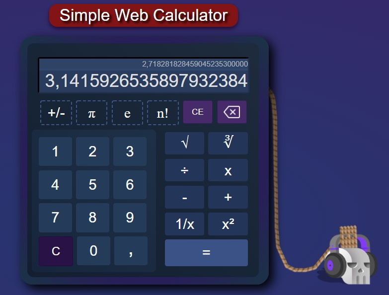

# Simple Web Calculator

### A basic calculator made only in HTML, CSS and JavaScript.


This is a simple arithmetic web calculator, with some implementations of a scientific one.




## Requeriments

- [HTML5](https://developer.mozilla.org/en-US/docs/Web/HTML)
- [CSS3](https://www.w3.org/Style/CSS/Overview.en.html)
- [JavaScript](https://www.javascript.com/)


## Contributions

Pull requests are welcome. So if you've got an idea of how to improve this code, I'll thank you for opening an issue to check that change that you want to make.


## Credits

- Social icons from [w3schools](https://www.w3schools.com/icons/fontawesome_icons_brand.asp).
- Delete icon from [Those-Icons (flaticon)](https://www.flaticon.com/authors/those-icons).
- Skull icon from [Freepik (flaticon)](https://www.flaticon.com/free-icon/skull_3554197).
- Ropes icon from [Freepik (flaticon)](https://www.flaticon.com/free-icon/ropes_1382616).
- Headphones icon from [Nhor Phai(flaticon)](https://www.flaticon.com/free-icon/headphones_2590162?related_id=2590061&origin=search).


## ```Project Status: Almost complete```

## License

#### MIT © [Luciano Esteban](https://github.com/LucioFex)