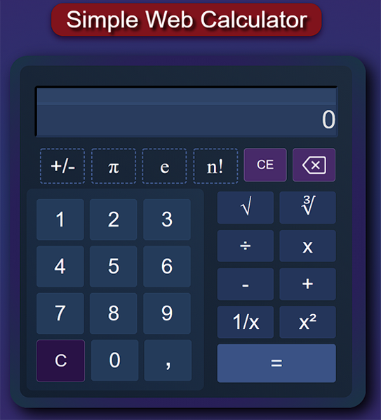

# Simple Web Calculator (Still in development)

### A basic calculator made only in HTML, CSS and JavaScript.

This is a simple arithmetic web calculator, with some implementations of a scientific one.

## Requeriments
- [HTML5](https://developer.mozilla.org/en-US/docs/Web/HTML)
- [CSS3](https://www.w3.org/Style/CSS/Overview.en.html)
- [JavaScript](https://www.javascript.com/)
 
 
 ## Contributions
 Pull requests are welcome. So if you've got an idea of how to improve this code, I'll thank you for opening an issue to check that change that you want to make.
 

 ## Credits
- Delete icon made by [Those-Icons](https://www.flaticon.com/authors/those-icons) from www.flaticon.com.
- Social icons from [w3schools](https://www.w3schools.com/icons/fontawesome_icons_brand.asp).
 
## License
[MIT LICENSE](https://choosealicense.com/licenses/mit/)